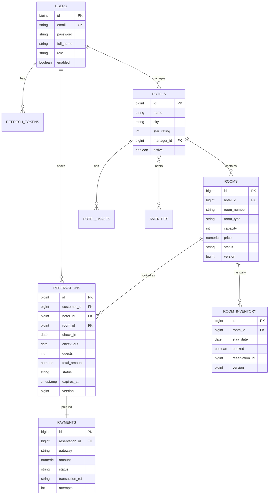
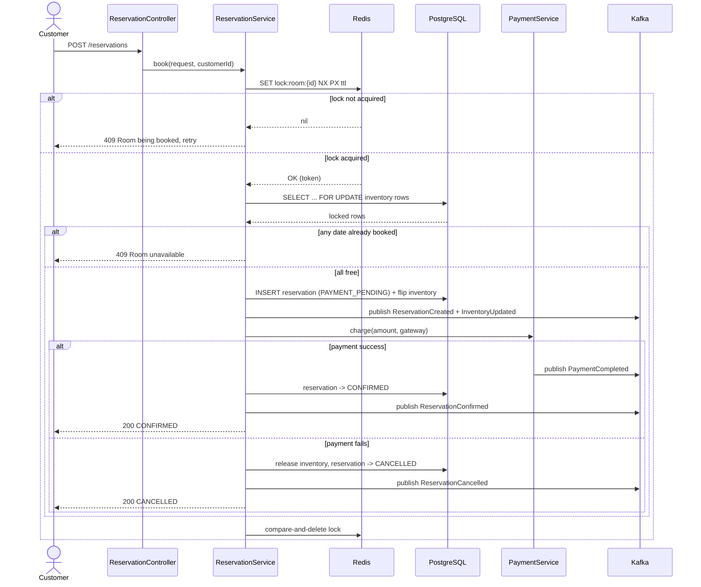

# Diagrams

## Entity Relationship Diagram

```mermaid
erDiagram
    USERS ||--o{ REFRESH_TOKENS : has
    USERS ||--o{ HOTELS : manages
    USERS ||--o{ RESERVATIONS : books
    HOTELS ||--o{ ROOMS : contains
    HOTELS ||--o{ HOTEL_IMAGES : has
    HOTELS }o--o{ AMENITIES : offers
    ROOMS ||--o{ ROOM_INVENTORY : "has daily"
    ROOMS ||--o{ RESERVATIONS : "booked as"
    RESERVATIONS ||--|| PAYMENTS : "paid via"

    USERS {
        bigint id PK
        string email UK
        string password
        string full_name
        string role
        boolean enabled
    }
    HOTELS {
        bigint id PK
        string name
        string city
        int star_rating
        bigint manager_id FK
        boolean active
    }
    ROOMS {
        bigint id PK
        bigint hotel_id FK
        string room_number
        string room_type
        int capacity
        numeric price
        string status
        bigint version
    }
    ROOM_INVENTORY {
        bigint id PK
        bigint room_id FK
        date stay_date
        boolean booked
        bigint reservation_id
        bigint version
    }
    RESERVATIONS {
        bigint id PK
        bigint customer_id FK
        bigint hotel_id FK
        bigint room_id FK
        date check_in
        date check_out
        int guests
        numeric total_amount
        string status
        timestamp expires_at
        bigint version
    }
    PAYMENTS {
        bigint id PK
        bigint reservation_id FK
        string gateway
        numeric amount
        string status
        string transaction_ref
        int attempts
    }
```

## Booking Sequence Diagram

```mermaid
sequenceDiagram
    actor Customer
    participant API as ReservationController
    participant Svc as ReservationService
    participant Redis
    participant DB as PostgreSQL
    participant Pay as PaymentService
    participant Kafka

    Customer->>API: POST /reservations
    API->>Svc: book(request, customerId)
    Svc->>Redis: SET lock:room:{id} NX PX ttl
    alt lock not acquired
        Redis-->>Svc: nil
        Svc-->>Customer: 409 Room being booked, retry
    else lock acquired
        Redis-->>Svc: OK (token)
        Svc->>DB: SELECT ... FOR UPDATE inventory rows
        DB-->>Svc: locked rows
        alt any date already booked
            Svc-->>Customer: 409 Room unavailable
        else all free
            Svc->>DB: INSERT reservation (PAYMENT_PENDING) + flip inventory
            Svc->>Kafka: publish ReservationCreated + InventoryUpdated
            Svc->>Pay: charge(amount, gateway)
            alt payment success
                Pay->>Kafka: publish PaymentCompleted
                Svc->>DB: reservation -> CONFIRMED
                Svc->>Kafka: publish ReservationConfirmed
                Svc-->>Customer: 200 CONFIRMED
            else payment fails
                Svc->>DB: release inventory, reservation -> CANCELLED
                Svc->>Kafka: publish ReservationCancelled
                Svc-->>Customer: 200 CANCELLED
            end
        end
        Svc->>Redis: compare-and-delete lock
    end
```
