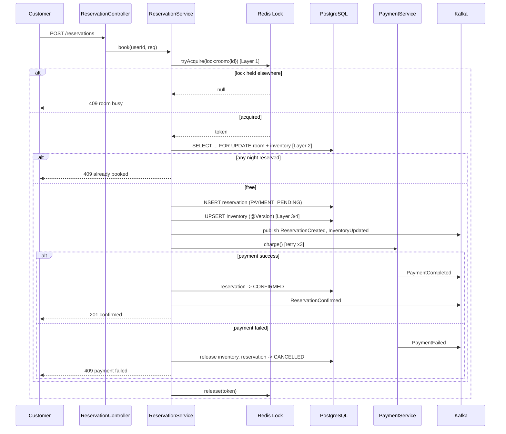

# Booking Sequence (High-Concurrency Path)

```mermaid
sequenceDiagram
    participant C as Customer
    participant API as ReservationController
    participant SVC as ReservationService
    participant RLK as Redis Lock
    participant DB as PostgreSQL
    participant PAY as PaymentService
    participant K as Kafka

    C->>API: POST /reservations
    API->>SVC: book(userId, req)
    SVC->>RLK: tryAcquire(lock:room:{id}) [Layer 1]
    alt lock held elsewhere
        RLK-->>SVC: null
        SVC-->>C: 409 room busy
    else acquired
        RLK-->>SVC: token
        SVC->>DB: SELECT ... FOR UPDATE room + inventory [Layer 2]
        alt any night reserved
            SVC-->>C: 409 already booked
        else free
            SVC->>DB: INSERT reservation (PAYMENT_PENDING)
            SVC->>DB: UPSERT inventory (@Version) [Layer 3/4]
            SVC->>K: publish ReservationCreated, InventoryUpdated
            SVC->>PAY: charge() [retry x3]
            alt payment success
                PAY->>K: PaymentCompleted
                SVC->>DB: reservation -> CONFIRMED
                SVC->>K: ReservationConfirmed
                SVC-->>C: 201 confirmed
            else payment failed
                PAY->>K: PaymentFailed
                SVC->>DB: release inventory, reservation -> CANCELLED
                SVC-->>C: 409 payment failed
            end
        end
        SVC->>RLK: release(token)
    end
```
