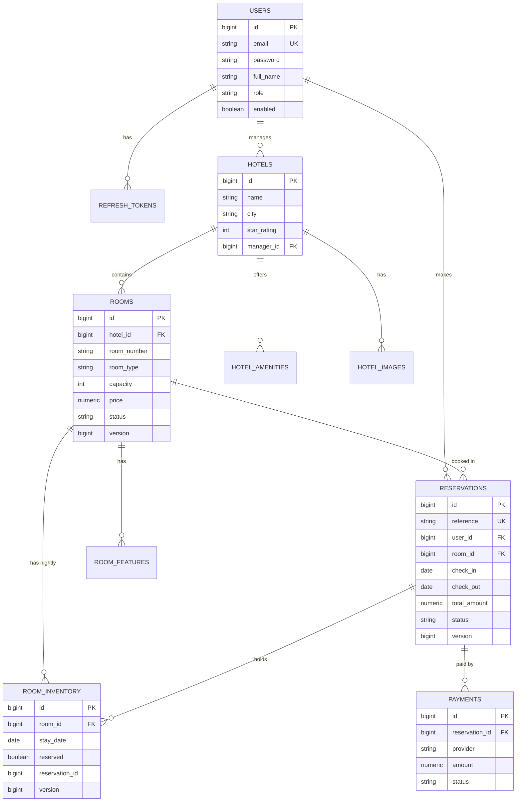

# Entity Relationship Diagram

```mermaid
erDiagram
    USERS ||--o{ REFRESH_TOKENS : has
    USERS ||--o{ HOTELS : manages
    USERS ||--o{ RESERVATIONS : makes
    HOTELS ||--o{ ROOMS : contains
    HOTELS ||--o{ HOTEL_AMENITIES : offers
    HOTELS ||--o{ HOTEL_IMAGES : has
    ROOMS ||--o{ ROOM_FEATURES : has
    ROOMS ||--o{ ROOM_INVENTORY : "has nightly"
    ROOMS ||--o{ RESERVATIONS : "booked in"
    RESERVATIONS ||--o{ PAYMENTS : "paid by"
    RESERVATIONS ||--o{ ROOM_INVENTORY : "holds"

    USERS {
        bigint id PK
        string email UK
        string password
        string full_name
        string role
        boolean enabled
    }
    HOTELS {
        bigint id PK
        string name
        string city
        int star_rating
        bigint manager_id FK
    }
    ROOMS {
        bigint id PK
        bigint hotel_id FK
        string room_number
        string room_type
        int capacity
        numeric price
        string status
        bigint version
    }
    ROOM_INVENTORY {
        bigint id PK
        bigint room_id FK
        date stay_date
        boolean reserved
        bigint reservation_id
        bigint version
    }
    RESERVATIONS {
        bigint id PK
        string reference UK
        bigint user_id FK
        bigint room_id FK
        date check_in
        date check_out
        numeric total_amount
        string status
        bigint version
    }
    PAYMENTS {
        bigint id PK
        bigint reservation_id FK
        string provider
        numeric amount
        string status
    }
```
